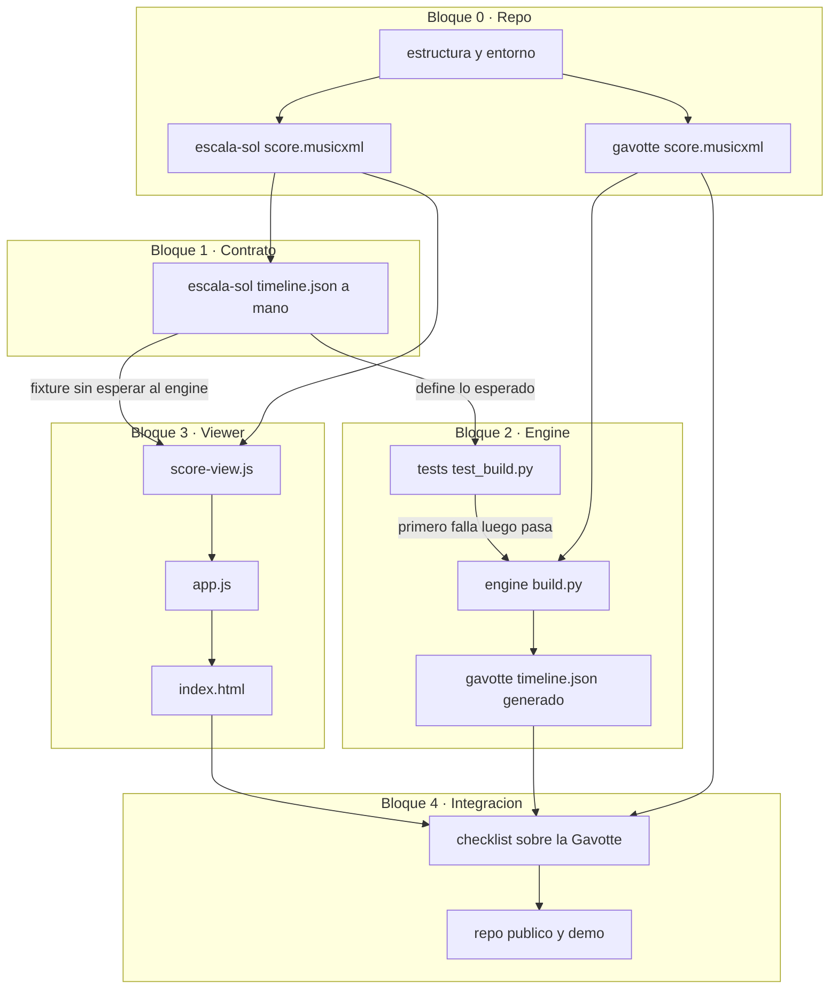

# Pasos de construcción: andamiaje

Receta pura: qué crear, en qué orden, qué va dentro de cada fichero. El porqué de cada decisión de diseño está en [andamiaje.md](andamiaje.md); este documento añade la capa que faltaba: la misión de cada bloque, cómo conecta con el siguiente, y el mapa completo de qué produce qué. Sigue los defaults de las 7 decisiones propuestas en andamiaje.md (repo público, silencios fuera, OSMD por CDN, puntero simple, ligaduras separadas, doble cuerda a la aguda, harness antes que modelos). Si quieres cambiar alguna antes de empezar, dilo y ajusto la receta.

---

## Mapa del bloque a bloque

Antes de los pasos, el diagrama de creación completo: qué fichero produce cada bloque, y qué fichero de un bloque anterior consume cada uno. Las flechas son literalmente "de aquí sale esto, que alimenta esto otro". Versión cuidada, con los dos caminos (engine/viewer) diferenciados por color: [El mapa de bloques](https://claude.ai/code/artifact/ba1a04a6-5c93-40fd-9fab-656b37c04c6b). El Mermaid de abajo es el mismo grafo, como respaldo que se renderiza directo en GitHub.



**Por qué este orden, leyendo el diagrama.** El bloque 1 es una **bifurcación**: el mismo fichero (`timeline.json` a mano) se convierte en la entrada de dos caminos que no se tocan entre sí. Camino A: alimenta el test del engine, como los valores que el motor debe reproducir a partir de una partitura real. Camino B: alimenta el viewer directamente, como el dato que mueve el cursor. Por eso los bloques 2 y 3 pueden construirse en cualquier orden, o incluso a la vez en dos tardes distintas: ninguno espera al otro, los dos esperan solo al bloque 1.

El bloque 4 es el **punto de encuentro**: junta lo que produjo el camino A (`timeline.json` real de la Gavotte) con lo que produjo el camino B (el viewer entero) y comprueba que encajan sobre una pieza que ninguno de los dos caminos vio antes por separado. Si el bloque 4 falla, el propio diagrama dice dónde mirar: si el fallo es de tiempos o notas, camino A (engine); si el fallo es de qué se ve en pantalla o el cursor no avanza bien, camino B (viewer). Esa es la razón de fondo por la que el contrato va en su propio bloque, antes que nada más: es el único punto del plan donde una sola pieza (un JSON de 30 líneas) determina que todo lo posterior pueda construirse, probarse y depurarse por separado.

---

## Bloque 0 · Repo y estructura

**Misión:** darle a todo lo demás un sitio físico y unos ingredientes reales donde apoyarse. Ningún bloque posterior tiene con qué trabajar sin esto: ni carpetas, ni entorno Python, ni las dos partituras.

**Conecta con:** entrega `score.musicxml` de las dos piezas. El de la escala lo consume directamente el bloque 3 (viewer); el de la Gavotte lo consume el bloque 2 (engine) y, ya generado su timeline, el bloque 4. Nada de este bloque depende de ningún otro: es la raíz del diagrama.

- [ ] **Crear el repo**
```bash
mkdir -p ~/workspace/atril && cd ~/workspace/atril
git init
mkdir -p engine viewer data/pieces/escala-sol data/pieces/gavotte-gossec
```

- [ ] **Entorno Python**
```bash
uv init --python 3.12
uv add music21
uv add --dev pytest
```

- [ ] **Config de pytest**, para que encuentre `engine` desde la raíz. Añade a `pyproject.toml` (al final del fichero, uv ya lo habrá creado):
```toml
[tool.pytest.ini_options]
pythonpath = ["."]
```

- [ ] **`.gitignore`** (fichero nuevo, en la raíz):
```
__pycache__/
*.py[cod]
.venv/
.pytest_cache/
*.egg-info/
.env
```

- [ ] **`README.md`** (fichero nuevo, en la raíz), plantilla de arranque:
```markdown
# Atril

Sistema de práctica de violín: partitura digital con cursor sincronizado, feedback de afinación en milímetros de diapasón, y un agent profesor que aprende de tu progreso.

## Estado

En construcción. Andamiaje en curso: motor de partitura (Python + music21) y visor (OSMD) sin LLM ni ML todavía.

## Cómo ejecutarlo

\`\`\`bash
uv run python -m engine.build data/pieces/gavotte-gossec
uv run python -m http.server 8000   # desde la raíz del repo
# abrir http://localhost:8000/viewer/index.html?piece=gavotte-gossec
\`\`\`
```

- [ ] **Las dos partituras de prueba** (pasos manuales, no ficheros que yo pueda escribir):
  - En MuseScore: escala de Sol mayor, 8 negras ascendentes, G4 a G5, indicación de tempo negra=80. Exportar como MusicXML y guardar en `data/pieces/escala-sol/original.musicxml`.
  - Descargar la Gavotte de Gossec en MusicXML (MuseScore.com o IMSLP) y guardarla en `data/pieces/gavotte-gossec/original.musicxml`.
  - Copiar cada una a su `score.musicxml` (sin OMR de por medio, hoy son el mismo fichero; mantiene el contrato de carpetas del diseño para cuando llegue el PDF):
```bash
cp data/pieces/escala-sol/original.musicxml data/pieces/escala-sol/score.musicxml
cp data/pieces/gavotte-gossec/original.musicxml data/pieces/gavotte-gossec/score.musicxml
```

- [ ] **Verificar:**
```bash
uv run python -c "import music21"
```
Sin errores, y las dos partituras abren en MuseScore.

- [ ] **Commit:**
```bash
git add .gitignore README.md pyproject.toml uv.lock data/pieces
git commit -m "andamiaje: estructura del repo y partituras de prueba"
```

---

## Bloque 1 · El contrato: timeline.json a mano

**Misión:** fijar la forma exacta de la frontera entre motor y visor antes de que ninguno de los dos exista, para que se puedan construir por separado sin coordinarse en el camino. Es el bloque más corto y el que más compra: sin él, 2 y 3 tendrían que levantarse a la vez o esperarse el uno al otro.

**Conecta con:** este es el fichero bisagra del diagrama. Alimenta al bloque 2 como el examen que el engine tiene que aprobar (valores conocidos de antemano), y al bloque 3 como el dato real que mueve el cursor, sin que el engine exista todavía. A partir de aquí, 2 y 3 dejan de depender entre sí.

- [ ] **`data/pieces/escala-sol/timeline.json`** (fichero nuevo), contenido completo:
```json
{
  "piece": "escala-sol",
  "tempo_map": [ { "measure": 1, "bpm": 80 } ],
  "events": [
    { "index": 0, "pitch": "G4",  "freq_hz": 392.00, "start_s": 0.00, "duration_s": 0.75, "measure": 1, "beat": 1.0, "string": null, "finger": null },
    { "index": 1, "pitch": "A4",  "freq_hz": 440.00, "start_s": 0.75, "duration_s": 0.75, "measure": 1, "beat": 2.0, "string": null, "finger": null },
    { "index": 2, "pitch": "B4",  "freq_hz": 493.88, "start_s": 1.50, "duration_s": 0.75, "measure": 1, "beat": 3.0, "string": null, "finger": null },
    { "index": 3, "pitch": "C5",  "freq_hz": 523.25, "start_s": 2.25, "duration_s": 0.75, "measure": 1, "beat": 4.0, "string": null, "finger": null },
    { "index": 4, "pitch": "D5",  "freq_hz": 587.33, "start_s": 3.00, "duration_s": 0.75, "measure": 2, "beat": 1.0, "string": null, "finger": null },
    { "index": 5, "pitch": "E5",  "freq_hz": 659.25, "start_s": 3.75, "duration_s": 0.75, "measure": 2, "beat": 2.0, "string": null, "finger": null },
    { "index": 6, "pitch": "F#5", "freq_hz": 739.99, "start_s": 4.50, "duration_s": 0.75, "measure": 2, "beat": 3.0, "string": null, "finger": null },
    { "index": 7, "pitch": "G5",  "freq_hz": 783.99, "start_s": 5.25, "duration_s": 0.75, "measure": 2, "beat": 4.0, "string": null, "finger": null }
  ]
}
```

- [ ] **Verificar:**
```bash
python -m json.tool data/pieces/escala-sol/timeline.json
```

- [ ] **Commit:**
```bash
git add data/pieces/escala-sol/timeline.json
git commit -m "andamiaje: contrato timeline.json escrito a mano"
```

---

## Bloque 2 · Engine

**Misión:** demostrar que una partitura real se puede convertir en instrucciones de reloj (segundos, no compases) de forma determinista y verificable, sin depender de nada visual. Es la mitad "sorda y ciega" del sistema: entra un fichero, sale otro, y se prueba entera sin abrir un navegador.

**Conecta con:** consume `score.musicxml` de la Gavotte (bloque 0) y usa el `timeline.json` a mano del bloque 1 solo como examen, no como entrada de datos. Produce el `timeline.json` real de la Gavotte, que el bloque 4 necesita para la prueba de integración. No depende del bloque 3 ni lo bloquea: puede hacerse antes, después o en paralelo.

- [ ] **`tests/test_build.py`** (fichero nuevo, crea también la carpeta `tests/`), contenido completo:
```python
from pathlib import Path

from engine.build import build

PIEZA = Path("data/pieces/escala-sol")


def test_engine_build_escala_sol():
    timeline = build(PIEZA)
    events = timeline["events"]
    assert len(events) == 8
    assert events[0]["start_s"] == 0.0
    assert events[-1]["start_s"] == 5.25
    assert events[1]["pitch"] == "A4"
    assert events[1]["freq_hz"] == 440.0
```

- [ ] **Ejecutar y ver fallar** (todavía no existe `engine/build.py`):
```bash
uv run pytest -v
```
Esperado: `ModuleNotFoundError` o similar. Si no falla, algo va mal con el test.

- [ ] **`engine/__init__.py`** (fichero nuevo, vacío): crea el fichero sin contenido, solo para que `engine/` sea un paquete importable.

- [ ] **`engine/build.py`** (fichero nuevo), contenido completo:
```python
import json
import sys
from pathlib import Path

from music21 import converter


def build(piece_dir: Path) -> dict:
    score = converter.parse(piece_dir / "score.musicxml")
    part = score.parts[0].flatten()
    mm = part.getElementsByClass("MetronomeMark").first()
    bpm = mm.number if mm and mm.number else 80
    spq = 60.0 / bpm  # segundos por negra
    events = []
    for i, n in enumerate(part.notes):  # .notes = notas y acordes, sin silencios
        if n.isChord:
            n = n.notes[-1]  # ponytail: doble cuerda -> nota aguda; acordes reales, en el MVP
        events.append({
            "index": i,
            "pitch": n.pitch.nameWithOctave,
            "freq_hz": round(n.pitch.frequency, 2),
            "start_s": round(float(n.offset) * spq, 3),
            "duration_s": round(float(n.duration.quarterLength) * spq, 3),
            "measure": n.measureNumber,
            "beat": float(n.beat),
            "string": None,
            "finger": None,
        })
    return {
        "piece": piece_dir.name,
        "tempo_map": [{"measure": 1, "bpm": bpm}],
        "events": events,
    }


if __name__ == "__main__":
    piece_dir = Path(sys.argv[1])
    timeline = build(piece_dir)
    out = piece_dir / "timeline.json"
    out.write_text(json.dumps(timeline, indent=2))
    print(f"escrito {out} ({len(timeline['events'])} eventos)")
```

- [ ] **Ejecutar y ver pasar:**
```bash
uv run pytest -v
```
Esperado: PASS.

- [ ] **Generar el timeline real de la Gavotte:**
```bash
uv run python -m engine.build data/pieces/gavotte-gossec
```
Revisa el `timeline.json` resultante: el `start_s` del último evento debe cuadrar a ojo con la duración real de la pieza a su BPM.

- [ ] **Commit:**
```bash
git add engine tests data/pieces/gavotte-gossec/timeline.json
git commit -m "andamiaje: engine MusicXML -> timeline.json"
```

---

## Bloque 3 · Viewer

**Misión:** demostrar que una lista de instrucciones de reloj mueve un cursor sobre una partitura visible, sin depender de nada del motor real. Es la mitad "muda" del sistema: no sabe nada de música, solo sabe mirar un reloj y señalar.

**Conecta con:** consume `score.musicxml` y `timeline.json` a mano de la escala (bloques 0 y 1); no toca nada del bloque 2. Produce el viewer completo, que el bloque 4 reutiliza tal cual, solo cambiándole de pieza por la URL.

- [ ] **`viewer/score-view.js`** (fichero nuevo), contenido completo:
```javascript
// score-view.js: lo unico que sabe de OSMD en todo Atril
class ScoreView {
  constructor(container) {
    this.osmd = new opensheetmusicdisplay.OpenSheetMusicDisplay(
      container, { followCursor: true });
    this.index = -1;
  }
  async load(xmlText) {
    await this.osmd.load(xmlText);
    this.osmd.render();
    this.osmd.cursor.show();
    this.index = 0;
  }
  seekTo(i) {            // solo hacia delante; volver atras = reset()
    while (this.index < i) {
      this.osmd.cursor.next();
      while (this._enSilencio()) this.osmd.cursor.next();
      this.index++;
    }
  }
  reset() { this.osmd.cursor.reset(); this.index = 0; }
  _enSilencio() {        // el timeline no trae silencios; el cursor si los pisa
    const notas = this.osmd.cursor.NotesUnderCursor();
    return notas.length > 0 && notas.every(n => n.isRest());
  }
}
```

- [ ] **`viewer/app.js`** (fichero nuevo), contenido completo:
```javascript
const PIECE = new URLSearchParams(location.search).get("piece") || "escala-sol";
const BASE = `/data/pieces/${PIECE}`;

const view = new ScoreView(document.getElementById("score"));
let events = [];
let reproduciendo = false;

const clock = {
  elapsed: 0, startedAt: null,
  play()  { this.startedAt = performance.now(); },
  pause() { this.elapsed += performance.now() - this.startedAt; this.startedAt = null; },
  reset() { this.elapsed = 0; this.startedAt = null; },
  now()   { return (this.elapsed + (this.startedAt ? performance.now() - this.startedAt : 0)) / 1000; }
};

let k = 0;
function tick() {
  const t = clock.now();
  while (k + 1 < events.length && events[k + 1].start_s <= t) k++;
  view.seekTo(k);
  if (reproduciendo) requestAnimationFrame(tick);
}

async function init() {
  const [xml, timeline] = await Promise.all([
    fetch(`${BASE}/score.musicxml`).then(r => r.text()),
    fetch(`${BASE}/timeline.json`).then(r => r.json()),
  ]);
  events = timeline.events;
  await view.load(xml);
}

document.getElementById("play").addEventListener("click", () => {
  if (reproduciendo) return;
  reproduciendo = true;
  clock.play();
  requestAnimationFrame(tick);
});
document.getElementById("pause").addEventListener("click", () => {
  reproduciendo = false;
  clock.pause();
});
document.getElementById("reset").addEventListener("click", () => {
  reproduciendo = false;
  clock.reset();
  k = 0;
  view.reset();
});

init();
```

- [ ] **`viewer/index.html`** (fichero nuevo), contenido completo. El orden de los `<script>` importa: OSMD antes que score-view.js, y ese antes que app.js.
```html
<!doctype html>
<html lang="es">
<head>
  <meta charset="utf-8">
  <title>Atril</title>
  <style>
    body { font-family: system-ui, sans-serif; margin: 24px; }
    #controls { margin-bottom: 16px; }
    #score { max-width: 900px; }
  </style>
</head>
<body>
  <div id="controls">
    <button id="play">Play</button>
    <button id="pause">Pause</button>
    <button id="reset">Reset</button>
  </div>
  <div id="score"></div>

  <script src="https://cdn.jsdelivr.net/npm/opensheetmusicdisplay@1.8.4/build/opensheetmusicdisplay.min.js"></script>
  <script src="score-view.js"></script>
  <script src="app.js"></script>
</body>
</html>
```

- [ ] **Servir y probar.** El servidor arranca desde la raíz del repo (no desde `viewer/`), porque `app.js` pide `/data/pieces/...` con ruta absoluta:
```bash
cd ~/workspace/atril
uv run python -m http.server 8000
```
Abrir `http://localhost:8000/viewer/index.html?piece=escala-sol`. Play mueve el cursor por las 8 notas; pausa y reset funcionan.

- [ ] **Commit:**
```bash
git add viewer
git commit -m "andamiaje: viewer con OSMD, reloj y cursor"
```

---

## Bloque 4 · Integración

**Misión:** verificar que las dos demostraciones anteriores encajan de verdad sobre una pieza real, no solo sobre el caso de juguete. Es la prueba de que el riesgo más grande del diseño (que el evento n del timeline y el paso n del cursor de OSMD sean la misma nota) está resuelto, y el único bloque que junta motor y visor en la misma pantalla.

**Conecta con:** es el punto de encuentro del diagrama: junta el viewer del bloque 3 con el `timeline.json` real del bloque 2 y el `score.musicxml` real de la Gavotte del bloque 0. No produce ningún fichero nuevo que otro bloque futuro consuma directamente (cierra el andamiaje); lo que sí deja es la base sobre la que arranca [El camino del Listener](listener-ml.md), cuya primera etapa necesita precisamente el engine que este bloque termina de validar.

- [ ] **Probar con la pieza real:** con el servidor del bloque 3 corriendo, abrir `http://localhost:8000/viewer/index.html?piece=gavotte-gossec`.

- [ ] **Checklist** (todas deben cumplirse):
  - El cursor pisa la primera nota en el segundo 0.
  - A mitad de pieza, el cursor sigue la nota que suena (comprueba cantando o con metrónomo al BPM del timeline).
  - Llega a la última nota en el instante que dice su `start_s` (cronómetro en mano).
  - Pausa, reanudación y reinicio funcionan sin saltos.

- [ ] Si algo falla: mira primero `data/pieces/gavotte-gossec/timeline.json` (¿los números están mal? bug del engine, camino A del diagrama) contra lo que hace el cursor (¿los números están bien pero el cursor no los sigue? bug del viewer, camino B). Ver "para discutir" del bloque 4 en andamiaje.md si es un problema de correspondencia nota-cursor.

- [ ] **Cerrar el repo:** graba un gif corto del cursor moviéndose sobre la Gavotte, añádelo al README, elige licencia (MIT por defecto: crea `LICENSE` con tu nombre y el año), y:
```bash
git add README.md LICENSE
git commit -m "andamiaje: cierre, README con demo"
```

- [ ] **Publicar** (repo público, decisión 1 propuesta): cuando quieras hacerlo tú mismo,
```bash
gh repo create atril --public --source=. --remote=origin --push
```

Con esto el andamiaje queda cerrado: siguiente parada, discutir el arranque de [El camino del Listener](listener-ml.md).
